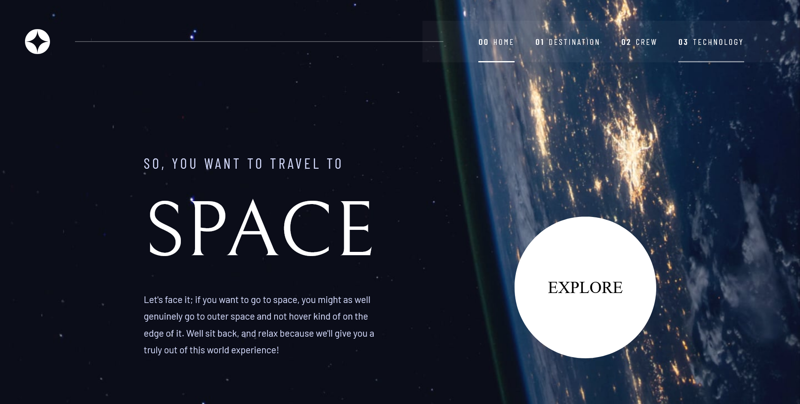

## Table of contents

- [Overview](#overview)
  - [The challenge](#the-challenge)
  - [Screenshot](#screenshot)
  - [Links](#links)
- [My process](#my-process)
  - [Built with](#built-with)
  - [Continued development](#continued-development)
- [Author](#author)

## Overview

Building Space Tourism Multi Page on React using react router for client side routing

### The challenge

Users should be able to:

- View the optimal layout for each of the website's pages depending on their device's screen size
- See hover states for all interactive elements on the page
- View each page and be able to toggle between the tabs to see new information

### Screenshot

### Links

<!-- - Solution URL: [https://www.frontendmentor.io/solutions/space-tourism-multipage-website-using-react-and-reactrouter-CkQ6O2x-7e] -->

- Live Site URL: [https://spacetourism-react-myasin.netlify.app/]

### Built with

- Semantic HTML5 markup
- CSS custom properties
- Flexbox
- CSS Grid
- Destop-first workflow
- [React](https://reactjs.org/) - JS library
- [Vitejs](https://vitejs.dev/) - React framework
- [React Router](https://reactrouter.com/) - For Client-Side-Routing

### Continued development

Using React and other third-party libraries

## Author

<!-- - Frontend Mentor - [@MYasin20](https://www.frontendmentor.io/profile/MYasin20) -->

- Github - [@MYasin20](https://github.com/MYasin20)
